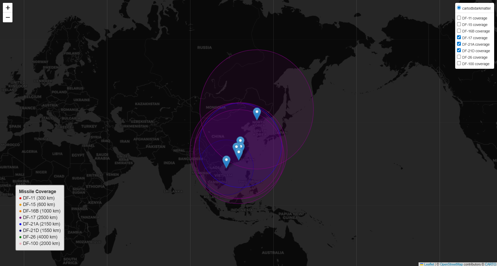

# PLARF Missile Coverage

An interactive visualization of missile coverage from selected brigades of the People’s Liberation Army Rocket Force (PLARF) facing the Western Pacific.  
This project maps approximate missile ranges using OSINT-based brigade coordinates and simplified missile performance data.



---

## Overview

This project visualizes the approximate range envelopes of major Chinese missile systems (DF-series SRBMs, MRBMs, IRBMs, HGVs, ICBMs, and LACMs) using:

- `folium` for interactive maps  
- `pandas` for data handling  
- Jupyter Notebook for running and exporting the final HTML map  
- A small Python module for clean, reusable map generation logic  

The map allows you to toggle each missile type individually, showing which brigades are equipped with which missile systems and how far each can reach.

This is a **technical and educational visualization**, not a military evaluation.  
All data is approximate and comes from publicly available sources.

---

## Features

- Separate map layer for **each missile type** (DF-11, DF-15, DF-16B, DF-17, DF-21A, DF-21D, DF-26, DF-41, DF-100)
- Only brigades equipped with a missile appear in that missile’s layer
- Color-coded range rings based on missile system
- Toggle layers on/off in the interactive map (Leaflet LayerControl)
- Lightweight CSV-driven data model
- Exportable HTML map for sharing or embedding

---

## Repository Structure

```
plarf-missile-coverage/
│
├─ data/
│   ├─ bases.csv                # PLARF brigades + coordinates + assigned missile
│   └─ ranges.csv               # Missile types, categories, and simplified ranges
│
├─ media
│
├─ notebooks/
│   ├─ plarf_missile_map.ipynb  # Main notebook (generate/export the map)
│   └─ archive/                 # Old or experimental notebooks
│
├─ output/
│   ├─ .output_keep             # Keeps folder tracked
│   └─ plarf_missile_coverage.html  # Exported interactive map (ignored in git)
│   └─ plarf_missile_coverage.png   # Screenshot for README (tracked)
│
├─ src/
│   └─ missile_map.py           # Core map-building logic
│
├─ .gitignore
├─ LICENSE
└─ README.md
```

---

## How to Run

### 1. Create a virtual environment (optional but recommended)

```
python -m venv .venv
source .venv/bin/activate      # macOS / Linux
.venv\Scripts\activate         # Windows
```

### 2. Install dependencies

```
pip install pandas folium notebook
```

### 3. Start Jupyter Notebook

```
jupyter notebook
```

### 4. Open the main notebook

Open:

```
notebooks/plarf_missile_map.ipynb
```

Run the notebook top-to-bottom.  
It will:

- Load data from CSV  
- Build the interactive PLARF coverage map  
- Save the HTML map to:

```
output/plarf_missile_coverage.html
```

Open that file in your browser to interact with the map.

---

## Data Sources

This project uses approximate, publicly available data from open sources.  
Missile ranges are nominal, rounded values for visualization only.

Primary reference:

```
James Martin Center for Nonproliferation Studies.
*People’s Liberation Army Rocket Force Order of Battle.*
July 10, 2023.
https://nonproliferation.org/wp-content/uploads/2023/07/web_peoples_liberation_army_rocket_force_order_of_battle_07102023.pdf
```

Additional values (ranges, coordinates, labels) may include small adjustments for clarity or compatibility with visualization.

---

## Included Missile Systems

| Missile | Category | Approx Range | Notes |
|--------|----------|---------------|-------|
| DF-11  | SRBM     | ~300 km       | Short-range |
| DF-15  | SRBM     | ~600 km       | Short-range |
| DF-16B | SRBM     | ~1000 km      | Extended-range SRBM |
| DF-17  | HGV      | ~2500 km      | Hypersonic glide vehicle |
| DF-21A | MRBM     | ~2150 km      | Classic MRBM |
| DF-21D | ASBM     | ~1550 km      | Anti-ship ballistic missile |
| DF-26  | IRBM     | ~4000 km      | Covers Guam |
| DF-41  | ICBM     | ~15,000 km    | Global range |
| DF-100 | LACM     | ~2000 km      | Long-range cruise missile |

---

## Disclaimer

This is a **non-classified**, OSINT-based visualization.  
Coordinates, ranges, and equipment assignments are approximate.  
This project makes no authoritative claims regarding PLARF readiness, composition, or capabilities.

---

## License

See the `LICENSE` file for details.
