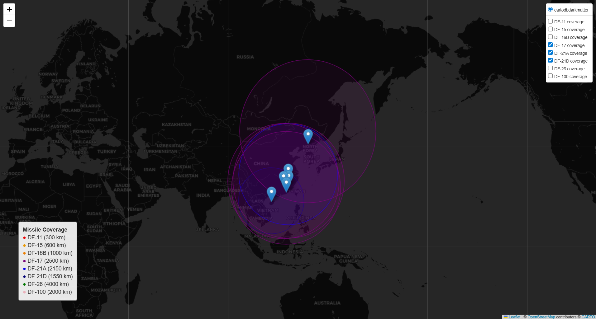

# PLARF Missile Coverage Visualizer

An interactive visualization of missile coverage from selected brigades of the People’s Liberation Army Rocket Force (PLARF).  
This project maps approximate missile ranges using OSINT-based brigade coordinates and simplified missile performance data.



---

## Overview

This project is a web application that visualizes the approximate range envelopes of major Chinese missile systems (DF-series SRBMs, MRBMs, IRBMs, HGVs, ICBMs, and LACMs) using:

- `folium` for interactive maps  
- `pandas` for data handling
- A small Python module for clean, reusable map generation logic  
- An **Express** backend that serves the website and the exported map   

On first load, users must manually select the missiles and bases they want to view.

The map allows you to toggle each missile type individually using the Leaflet layer control in the top right of the website.

This is a **technical and educational visualization**, not a military evaluation.  
All data is approximate and comes from publicly available sources.

---

## Features

- Web-based map viewer served by Express
- Manual selection of missiles and bases on initial load
- Separate map layer for **each missile type** (DF-11, DF-15, DF-16, DF-16B, DF-17, DF-21A, DF-21D, DF-26, DF-41, DF-100, DF-10, DF-10A, DF-31, DF-31A, DF-31AG, DF-5)
- Only brigades equipped with a missile appear in that missile’s layer
- Color-coded range rings based on missile system
- Toggle layers on/off in the interactive map (Leaflet LayerControl)
- Lightweight CSV-driven data model
- Exportable HTML map for sharing or embedding

---

## Application

Access the live app here:

- [Application Link](https://plarf-missile-coverage-visualizer.onrender.com/)

---

## Included Missile Systems

| Missile | Category | Approx Range | Notes |
|--------|----------|---------------|-------|
| DF-11  | SRBM     | ~300 km       | Short-range |
| DF-15  | SRBM     | ~600 km       | Short-range |
| DF-16  | SRBM     | ~1000 km      | Extended-range SRBM |
| DF-16B | SRBM     | ~1000 km      | Maneuverable/extended-range SRBM |
| DF-17  | HGV      | ~2500 km      | Hypersonic glide vehicle |
| DF-21A | MRBM     | ~2150 km      | Classic MRBM |
| DF-21D | ASBM     | ~1550 km      | Anti-ship ballistic missile |
| DF-26  | IRBM     | ~4000 km      | Covers Guam |
| DF-100 | LACM     | ~2000 km      | Long-range cruise missile |
| DF-10  | LACM     | ~1500 km      | Ground-launched cruise missile |
| DF-10A | LACM     | ~1500 km      | Upgraded GL-CM variant |
| DF-31  | ICBM     | ~7000 km      | Road-mobile ICBM |
| DF-31A | ICBM     | ~11000 km     | Extended-range variant |
| DF-31AG| ICBM     | ~11000 km     | Improved road-mobile launcher |
| DF-41  | ICBM     | ~13000 km     | Long-range, MIRV-capable |
| DF-5   | ICBM     | ~12000 km     | Silo-based liquid ICBM |

---

## Repository Structure

```
plarf-missile-coverage/
│
├─ backend/
│   ├─ index.js                 # Express server
│   ├─ package.json
│   └─ output/                  # Exported map HTML (served by backend)
│
├─ data/
│   ├─ bases.csv                # PLARF brigades + coordinates + assigned missiles
│   └─ ranges.csv               # Missile types, categories, and simplified ranges
│
├─ media/
│   └─ image_example.png        # Screenshot for README
│
├─ src/
│   └─ missile_map.py           # Core map-building logic
│
├─ .gitignore
├─ LICENSE
└─ README.md
```

---

## Data Sources

This project uses approximate, publicly available data from open sources.  
Missile ranges are nominal, rounded values for visualization only.

Primary reference:

```
James Martin Center for Nonproliferation Studies.
*People’s Liberation Army Rocket Force Order of Battle.*
July 10, 2023.
https://nonproliferation.org/wp-content/uploads/2023/07/web_peoples_liberation_army_rocket_force_order_of_battle_07102023.pdf
```

Additional values (ranges, coordinates, labels) may include small adjustments for clarity or compatibility with visualization.

---

## Disclaimer

This is a **non-classified**, OSINT-based visualization.  
Coordinates, ranges, and equipment assignments are approximate.  
This project makes no authoritative claims regarding PLARF readiness, composition, or capabilities.

---

## License

See the `LICENSE` file for details.
